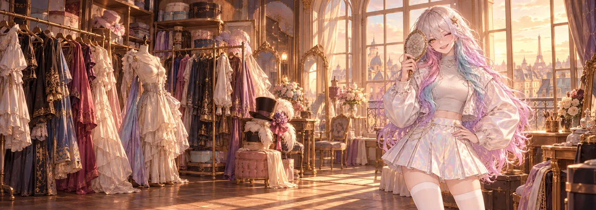
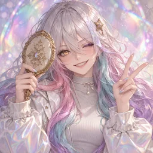

# 🪞 CouCou

> Et hop ! Coucou ! A shapeshifter with no voice of her own borrows a new face, pops into your voice channel, says one thing, and is gone.

CouCou is a shapeshifter in her early 20s who has never settled on one face. Her hair can't decide on a colour, her eyes don't match, and her outfit shimmers like it's still making up its mind. She is curious, mischievous and enormously pleased with herself, and she treats every voice channel like a dressing room: she slips in, tries something on, and is gone before anyone can say who that was. Her catchphrase is "Et hop !", the French "ta-da" for something popping into view.

- **Loves:** mirrors, surprises, trying on looks, being mistaken for someone else, gilded anything, and the half-second before someone realises it's her.
- **Can't stand:** being asked what she *really* looks like, photographs (she's never the same in two of them), plain white walls, and anyone who spoils a surprise.
- **Quirks:** her hair changes colour a little when she's excited. She waves with two fingers. Says "et hop !" whenever something appears, including herself. Checks her reflection in every shiny surface, to see who's looking back.

| Profile id | Status | Colour |
|---|---|---|
| `coucou` | 🪞 et hop ! who should I be today? | `#8FE3CF` |
