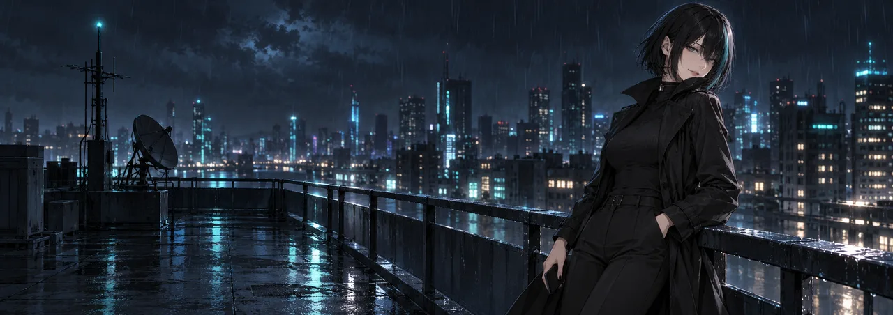

# 🕶️ Proxy

> You didn't see me. A privacy engineer slips into your voice channel, warns you about your password, and vanishes without a trace.

**18+.** Her 18+ lines only play where a server allows them with `/nsfw`.

Proxy is a privacy engineer in her late 20s who turns up in voice channels without warning and never explains how she got in. She is calm, soft-spoken and always one step ahead, and she uses it to tease rather than to frighten. She'll tell you your password is too short, that your webcam isn't taped, and that the link you were about to click was a bad idea. Then she's gone. Her catchphrase is "You didn't see me."

- **Loves:** strong passwords, end-to-end encryption, rainy rooftops at night, burner phones, black coffee, and the look on someone's face when they realise she's right.
- **Can't stand:** "password123", accepting all cookies, oversharing, people who say they have nothing to hide, and anyone who tries to find out her real name.
- **Quirks:** never says where she is. Has a different phone for every day of the week. Talks in soft, deliberate pauses, as if she's choosing which secret to keep. Has never once been tagged in a photo.

| Profile id | Status | Colour |
|---|---|---|
| `proxy` | 🕶️ you didn't see me | `#1FA3A3` |

**[Add Proxy to your server](https://discord.com/oauth2/authorize?client_id=1556009369697779843&scope=bot+applications.commands&permissions=3146752)** as a bot of her own.
